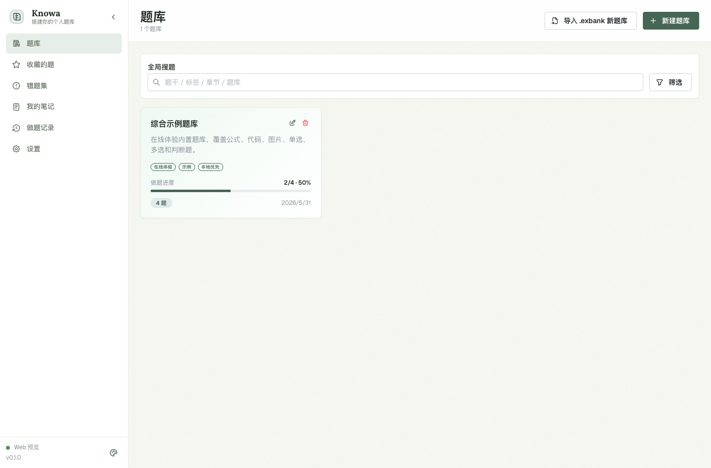

<p align="center">
  
</p>

<h1 align="center">Knowa</h1>

<p align="center">
  搭建你的个人题库
</p>

<p align="center">
  <a href="https://github.com/ExBook/Knowa/actions/workflows/release.yml"></a>
  <a href="https://github.com/ExBook/Knowa/releases/tag/v0.1.0"></a>
  
  
  
  
</p>

<p align="center">
  <a href="https://github.com/ExBook/Knowa/releases/tag/v0.1.0">下载桌面版</a>
  ·
  <a href="https://exlocal.pages.dev/">产品官网</a>
  ·
  <a href="https://exlocal.pages.dev/demo.html">在线体验</a>
  ·
  <a href="docs/design.md">设计文档</a>
</p>



## Knowa 是什么？

Knowa 是一款本地优先的个人题库与刷题应用。它适合学生、教师、考试备考者和长期整理知识资料的人：你可以创建自己的题库，录入富文本题目，用 Markdown 批量导入，按章节和知识点刷题，保存错题、收藏、笔记和每次做题记录，并把资料导出成 PDF、题库包或完整备份。

这个项目的核心理念是：题库是长期资料，不应该被锁在某个云端系统里。Knowa 默认把数据放在本地，桌面端还可以指定固定备份目录，方便你把题库、图片、记录和笔记完整迁移到另一台设备。

## 主要功能

| 能力 | 说明 |
| --- | --- |
| 题库管理 | 创建多个题库，设置描述、标签和浅色卡片颜色；题库卡片显示题目数量和进度条。 |
| 富文本录题 | 支持单选、多选、判断题；题干、选项、解析和笔记支持图片、行内代码、代码块、行内公式和整行公式。 |
| Markdown 导入 | 提供不同题型模板、实时预览、格式提醒、公式和代码渲染，适合批量整理题目。 |
| 多模式刷题 | 支持练习模式、考试模式、顺序、随机、章节、节、知识点筛选和自定义倒计时。 |
| 答题回顾 | 完成页显示圆形题号导航，用颜色标识正误；回顾题目时保留用户答案、正确答案和解析。 |
| 错题与收藏 | 错题集和收藏题支持搜索、按题库/章节分组、选择性重做和导出。 |
| 我的笔记 | 按题库组织有笔记的题目，重点展示笔记内容，支持编辑笔记、查看题目和导出。 |
| 做题记录 | 按日期和题组抽屉展示历史记录，支持回顾每次练习和重做题组。 |
| 专业导出 | 支持题库、收藏、错题、笔记的选择性导出；PDF 带 Knowa 标识，适合打印试卷或学术笔记。 |
| 完整备份 | `.exlocal` 备份包含题库、题目、图片、设置、做题记录和笔记，方便换设备。 |
| 桌面端 | 基于 Tauri v2，支持 macOS、Windows、Linux 打包、本地备份目录和文件关联。 |

## 产品界面

官网和 README 使用真实产品结构重新绘制的界面预览，展示题库卡片、进度条、侧边栏、最近练习和刷题状态。完整可交互体验请打开官网的在线体验页；手机端会提示使用桌面端，因为刷题和富文本预览需要更宽的操作空间。

## 下载

当前版本：`v0.1.0`

| 平台 | 建议 |
| --- | --- |
| macOS | 后续 Release 将优先提供 Universal 包，兼容 Apple Silicon 和 Intel Mac。 |
| Windows | 普通电脑下载 x64 安装包；ARM 设备可以尝试 ARM64。 |
| Linux | 优先使用 AppImage，也可以选择 deb 或 rpm。 |

下载地址：[GitHub Releases](https://github.com/ExBook/Knowa/releases/tag/v0.1.0)

## 在线体验

官网的“在线体验”入口会在桌面端进入 Knowa App 的真实网页版本 `/app/`，并自动准备一个完整示例题库，覆盖：

- 单选、多选、判断题。
- 行内代码、代码块、行内公式、图片题。
- 答题、交卷、题号导航、正误反馈和解析回顾。

在线体验入口：[https://exlocal.pages.dev/demo.html](https://exlocal.pages.dev/demo.html)

注意：`demo.html` 只是入口与移动端拦截页；真正运行的是 `/app/` 下的 Knowa 网页版。手机端不会加载在线体验功能，会提示用户到桌面端或大屏幕设备使用。

## 数据与备份

Knowa 的运行数据存储在本机 IndexedDB 中。桌面端可以在设置页选择本地备份目录，并导出专属后缀的完整备份包。

- `.exbank`：单个题库交换包，适合分享或迁移一个题库。
- `.exlocal`：完整数据备份包，包含题库、题目、设置、记录、笔记和图片。
- 桌面端默认备份目录会根据系统生成，也可以改成同步盘或资料目录。

常见默认路径：

```text
macOS: ~/Library/Application Support/com.exbook.exlocal/backups
Windows: %LOCALAPPDATA%\com.exbook.exlocal\backups
Linux: ~/.local/share/com.exbook.exlocal/backups
```

## 技术栈

| 层级 | 技术 |
| --- | --- |
| 前端 | React 18, TypeScript, Vite |
| UI | Mantine v7, TipTap, Recharts |
| 状态 | Zustand |
| 本地存储 | IndexedDB, Dexie |
| 桌面端 | Tauri v2 |
| 导出 | pdfmake, html2canvas, jsPDF, JSZip |
| 测试 | Vitest, fake-indexeddb |
| 官网 | Vite 静态站，适合部署到 Cloudflare Pages |

## 本地开发

安装依赖：

```bash
npm install
```

运行 Web 应用：

```bash
npm run dev
```

运行桌面端：

```bash
npm run desktop:dev
```

构建 Web 应用：

```bash
npm run build
```

构建当前平台桌面端：

```bash
npm run desktop:build
```

运行官网：

```bash
npm run site:dev
```

## 发布流程

`main` 分支推送后会触发 `.github/workflows/release.yml`：

1. 安装依赖。
2. 运行 lint、单元测试、Web 构建和官网构建。
3. 使用 Tauri Action 打包桌面端。
4. 上传 GitHub Release 资产并写入中文发布说明。

macOS 构建已调整为 Universal 包，避免 Intel Mac 单独占用 `macos-13` Runner 导致长时间排队。

## 文档

- [设计与架构文档](docs/design.md)
- [用户使用指南](docs/user-guide.md)
- [发布流程](docs/release.md)
- [v0.1.0 发布说明](docs/releases/v0.1.0.md)

## 项目状态

Knowa 当前处于 `0.1.x` 早期版本。核心单机学习工作流已经可用，后续会继续改进桌面端体验、导出排版、教程截图、示例题库和长期资料迁移能力。
